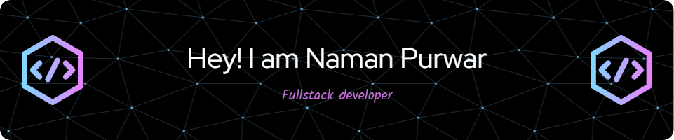

# Hi there! 👋

  I'm <strong>Naman</strong>, a dev from Kanpur(India), and i love playing Chess♟️.  
   Engineer🛠️| Problem Solver🧠| Crafting solutions, one problem at a time🔧.
   I'm always curious about how tech actually works🤔. It’s like a little puzzle I can’t stop trying to solve🧩.

  

  

